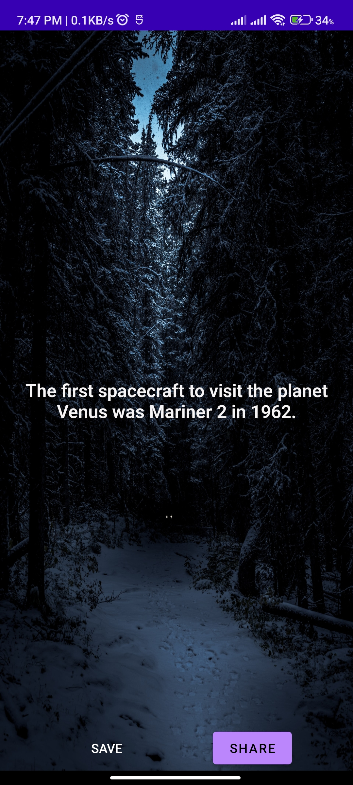
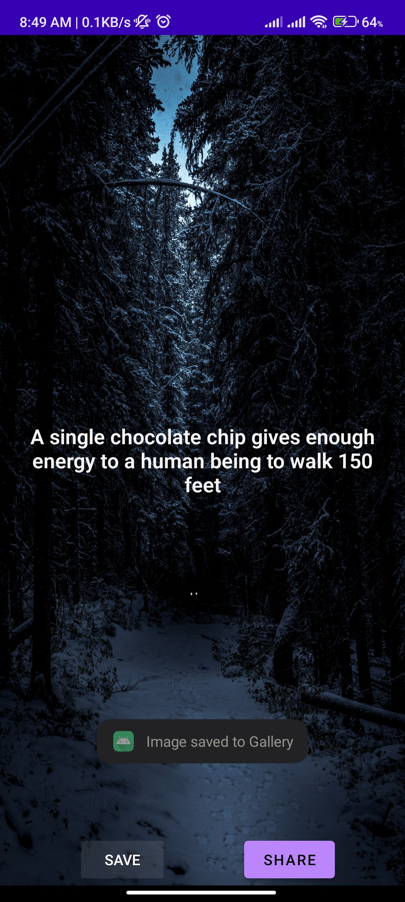
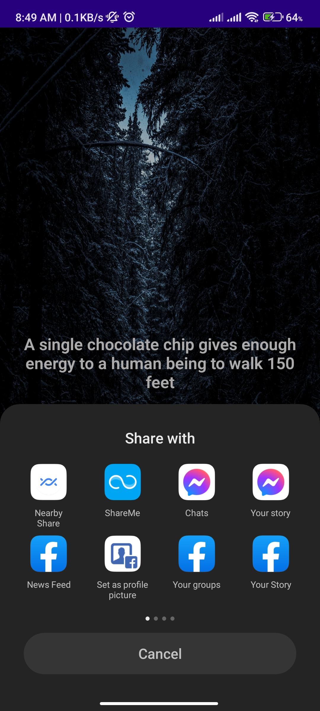

# Fact-O

### Simple Android App for Fetching and Displaying random Facts.

### Resourses Used
* **Language: Java**
* **External Library: Retrofit (for api calls), Gson(for converting json to java object)**
* **Free Api: [Api Ninjas](https://api-ninjas.com/api/facts)**

### Screenshots

- **Home**

- **Save To Gallery**

- **Share**

